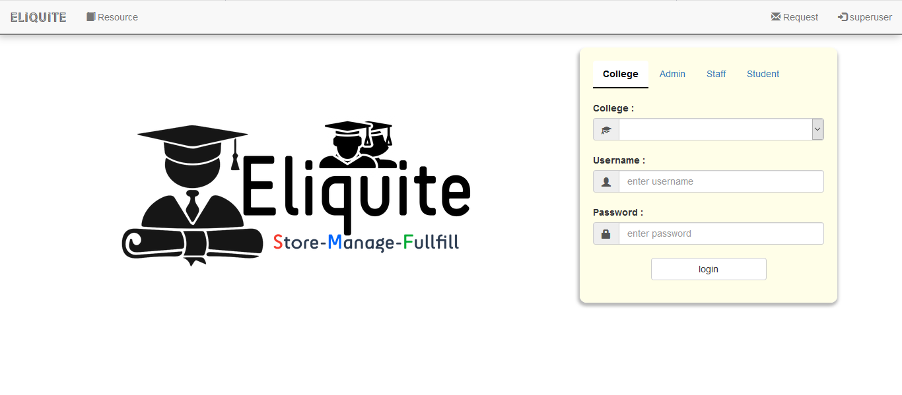
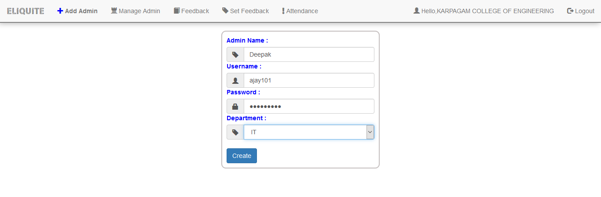
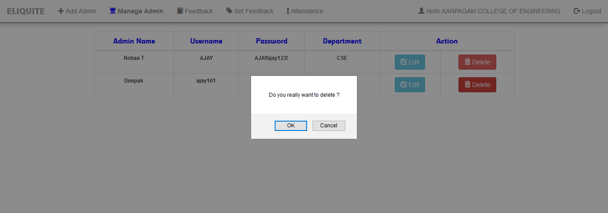
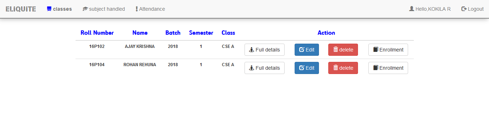

# ELIQUITE
Hello, Geekeee!!! I am Ajay V from Karpagam College of Engineering. I am very font of UI/UX design and I made this app for the better sake of Education.
Eliquite is a ERP Application which is a global authentication Application which provides the many modules such as attendance, feedback etc to satisfy
the college ERP modules.

<h3>Modules Covered</h3>
<ul>
<li>Subject Creation</li>
<li>Creating Staff Module</li>
<li>Classrooms Creation</li>
<li>Allocating Classrooms for particular Staff ( Tutor )</li>
<li>Allocating Subject Handled by staff</li>
<li>Providing staff to create students for particular class</li>
<li>Adding Resource for the handled subject by the staff</li>
<li>Students Enrollment</li>
<li>Downloading Resources uploaded By the staff</li>
<li>Attendance module to give attendance for each hour</li>
<li>Setting feedback by college Admin</li>
<li>Giving feedback for each staff</li>
</ul>

<h4>Creating Superuser</h4>
	This is the first level of the Application in which the full functionality is handled by an organisation. Here the organisation refers to me.
The superusers are the users who develops and update the Application whenever a new modules is introduced.For the first time the Application will prompt
,username and password to authenticate the Application.

<h4>Starting Page</h4>
	 
	This is the starting page of my application which provides the login UI for superusers,college etc...

<h4>Requesting Application Permission</h4>
	The college has to request the superuser to use this application for Education purpose

After Submitting the Requesition the superuser has to verify the college and create a login credentials for the college and the username and the password 
has to be send to the respective college mail 

<b>Login as superuser</b> 

<h4>Superuser Homepage</h4>
	This superuser homepage is the panel for superuser to maintain the product such as confirming or rejecting the college requestion, Extending superuser
and accessing all the data through console [we will discuss the console later] 

<h4>College Homepage</h4>
	College Module provide many functionality such as adding Admin ( here Admin refers to HOD ), Managing Admin, Creating Feedback , Scheduling periods etc..
In our Module the College create an authentication for each department, Each department should has only one admin(HOD)

We will discuss the Feedback and Attendance Module Later 
As we create the Admin(HOD) , Its time to login with Admin and acheive some stuff....Lets do it geekies....

<h4>College Homepage</h4>

	The Admin(HOD) module is a powerful module which provides many functionality such as creating batch, classroom, staffs , Allocating etc... 
Here we will discuss various functionality and acheive the hard stuffs . Please follow each steps so that you can acheive a lot for your maintainance... 
  
<u><b>Create Batch</b></u> 
	Consider a scenario that we have to store student details, Note that each student has a roll number, each student belongs to respective department, and Each 
students belongs to a batch . So batch creation is very important...  

  
<u><b>Create Class Rooms</b></u> 
	Many Students belongs to single department, and a single department has many batches , Each batch students are belongs to different sections. Here we will
define what are the classrooms available and we will get into it..

  
<u><b>Create Staff</b></u> 
	Now we have to create staff and provide login credentials. These staffs can handle subjects for many classrooms, these staffs may be a tutor for classrooms.
The staffs who are the tutor for respective classrooms can only have permission to create students for respective class. 

  
<u><b>Create Subject</b></u> 
	Creating subject by giving the course code and subject title, is an important process.The Admin(HOD) who create the subject will only belong to the respective 
department i.e the subject which is created by CSE HOD will only available to CSE department. Each subject will carry course code, credits and belong to seperate
group. 

 
	Each subject has some sub-sections such as assesments,practical and so on... Now we have to create sub sections for each subject.. 
We have to provide the fullmark and passmark for each sub-section... 

  
<u><b>Allocate Tutor</b></u> 
	Now it's time to allocate tutor for each classrooms. We have to handle it in a right manner for allocating staffs for each classrooms i.e same staff should
not be a tutor for both A and B section for same batch in same department. 
Here we have created three staffs <b>kokila</b>, <b>Rock</b> and <b>Jancy</b> .. But I have allocated Tutor as two staffs Kokila and Jancy. Note that I have not allocated Rock as Tutor.
As Rock is not the Tutor he can only teach subject but not able to create student module. 

  
<u><b>Allocate Subject</b></u> 
	Now we came to important functionality called subject allocation. The students can study the same subject but the classrooms are different , so different staffs
has to take the same subject for the student. So subject Allocation is very important. 
We know that we have created three staffs <b>kokila</b>, <b>Rock</b> and <b>Jancy</b> in which Rock is a non-tutor.Now here I allocate subjects for Rock and Kokila
but not Jancy.

We will discuss the Department Feedback Module Later.. 
Now We have created Three staff Modules , Lets make our UI dirty and we will see what is behind staff module..

 
<b>Note : </b>Now we will see the staff Module one by one and compare the difference. 
<b>Rock</b> :only Subject handler 
<b>Jancy</b> :only Tutor 
<b>Kokila</b> : Both Tutor and Subject handler 
  
<u><b>Staff Module (Rock)</b></u> 
	Here we will login with rock staff module and see what are available.  

<b><i>Here , Rock is a non-tutor ,so no class rooms are Allocated </i></b>  

<b><i>As Rock is allocated for two subjects it will be listed.</i></b> 
The Three buttons manage, Add Resource and Set Marks will be discussed after student Enrollment  
<u><b>Staff Module (Jancy)</b></u> 

  
<u><b>Staff Module (Kokila)</b></u> 

	Now you get a clear idea of subject Allocation and Tutor Allocation. Here upon seeing above we know that kokila is a tutor of cse A of 2018 batch.  
 
	Now as a tutor, the primary job is to maintain student details ....Lets go create some  
 
	Adding students include more than 40 fields but not all fields are mandatory.  

 
<b>Note: </b>A single class room has more than 60 students . So creating one by one is a tedious process. To overcome this file upload comes into play. 
Here for file uploading We will have sample document and the sample document has only header . We have to fill multiple details and upload it..  

 
Here the student has not enrolled any subject. So We can check it out as a student module.. 
<b>Note :</b>Inorder to acheive enrollment tutor has to enable the enrollment otherwise it will not happen..
  
<u><b>Filtering Students and Export</b></u> 
	Filtering of student is a powerful module in which we can filter the students based on field given. 

 
	Above will Export all students details  

  
<u><b>Add Resource</b></u> 
	Every staff may handle two or more subjects. Consider a scenario that the staff want to share some pdf for exam preparation for every students.here the staff 
can add resource for the particular handled subject. This resource can be downloaded by the students who enrolled this subject.  

